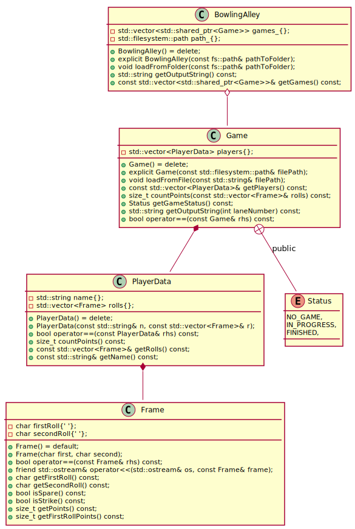

# Bowling project
Application code is available: [bowling-app](https://github.com/WojtekMs/testing/tree/master/bowling)

This repository contains a simple app which is counting points in a bowling game. This project was created in order to practice TDD methodology. 
Program loads input from a folder to which path must be given as a command-line argument. 
Optionally user can give a second argument as the name of the file where games results will be saved.
In case user doesn't know how to properly use the application, there is a manual available that is activated by passing one of the flags:
* -h
* --help
### App UML Diagram
<!-- 
@startuml ./bowling/uml/BowlingUML
class PlayerData{
    -std::string name{};
    -std::vector<Frame> rolls{};

    +PlayerData() = delete;
    +PlayerData(const std::string& n, const std::vector<Frame>& r);
    +bool operator==(const PlayerData& rhs) const;
    +size_t countPoints() const;
    +const std::vector<Frame>& getRolls() const;
    +const std::string& getName() const;
}

class Frame {
    -char firstRoll{' '};
    -char secondRoll{' '};

    +Frame() = default;
    +Frame(char first, char second);
    +bool operator==(const Frame& rhs) const;
    +friend std::ostream& operator<<(std::ostream& os, const Frame& frame);
    +char getFirstRoll() const;
    +char getSecondRoll() const;
    +bool isSpare() const;
    +bool isStrike() const;
    +size_t getPoints() const;
    +size_t getFirstRollPoints() const;
}

class Game{
    -std::vector<PlayerData> players{};
    +Game() = delete;
    +explicit Game(const std::filesystem::path& filePath);
    +void loadFromFile(const std::string& filePath);
    +const std::vector<PlayerData>& getPlayers() const;
    +size_t countPoints(const std::vector<Frame>& rolls) const;
    +Status getGameStatus() const;
    +std::string getOutputString(int laneNumber) const;
    +bool operator==(const Game& rhs) const;
}

enum Status{
        NO_GAME,
        IN_PROGRESS,
        FINISHED,
}

class BowlingAlley{
    -std::vector<std::shared_ptr<Game>> games_{};
    -std::filesystem::path path_{};
    +BowlingAlley() = delete;
    +explicit BowlingAlley(const fs::path& pathToFolder);
    +void loadFromFolder(const fs::path& pathToFolder);
    +std::string getOutputString() const;
    +const std::vector<std::shared_ptr<Game>>& getGames() const;
}
Game +-- Status : public
Game *-- PlayerData
PlayerData *-- Frame
BowlingAlley o-- Game
@enduml
-->

### How to build app
1. `git clone https://github.com/WojtekMs/testing`
2. `mkdir build`
2. `cd build`
3. `cmake ..`
4. `make -j`
5. `./bowling ../games`

### Technologies
* C++ Filesystem library
* TDD methodology

### Authors
* [Tomonike](https://github.com/Tomonike/)
* [Marcinati](https://github.com/Marcinati)
* [WojtekMs](https://github.com/WojtekMs/)
